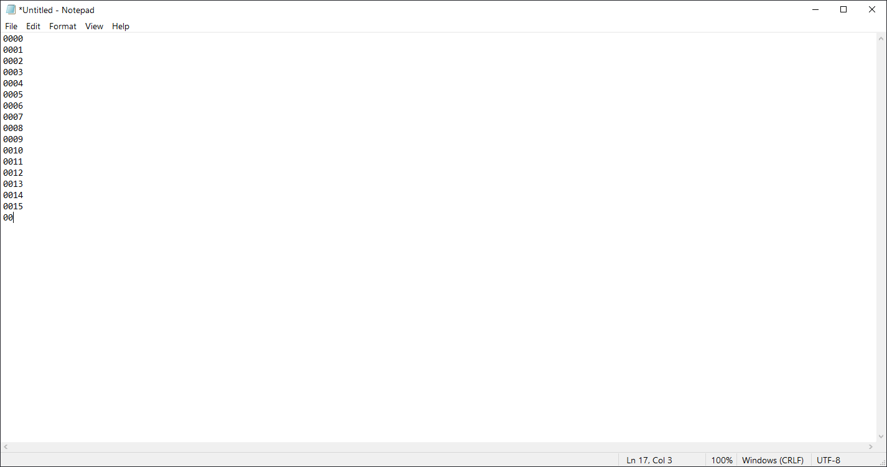

# PassCode/PIN Unlocker

This script tests all possible 4-digit expressions in order!\
It uses very few resources and It can be suitable for guessing Telegram local PassCode.

## How it works?

1. First, It runs the program we are trying to find the PassCode/PIN for (Put the location of your desired program instead of notepad)
2. It starts to enter 4-digit expressions in order and after each one press enter and some patience (from 0000 to 9999)

> There is no function to stop or exit the script and it must be closed manually via the TaskManager (wscript.exe).

## Screenshot

